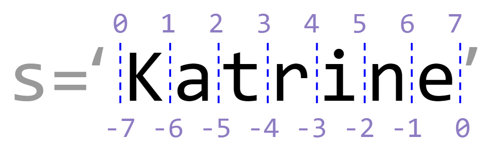
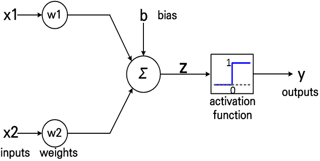
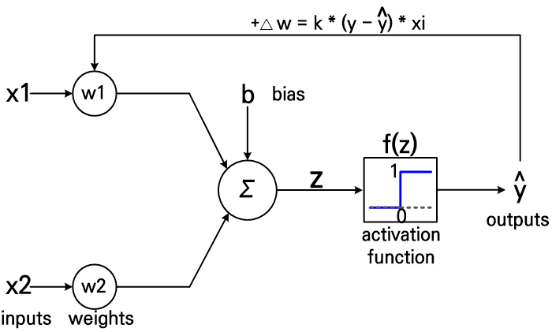

## 데이터 분석과 머신러닝 실습 1  

<div style="text-align: right"> 작성자 : 데이터사이언스연구소 유광명, 이영생, 임혜원 </div>  
---

### 1.1 마크다운(Mark Down) 언어 
---
커맨드모드에서 마크다운 모드로 전환하여 작성(`ESC -> M`) 

1) 헤드라인(Headline)

# 한국전력 신입사원 교육

## 한국전력 신입사원 교육

### 한국전력 신입사원 교육

2) 강조

**한국전력 신입사원 교육**

3) 목록

- 한국전력 신입사원 교육
- 입소를 축하드립니다.

* 목록1
+ 목록2

4) 코드 하이라이트

```
    print("Hello, world")
```

5) 기타

`마크다운` 사용하기

인용문
> 인용<br>
 인용하기


### 1.2 파이썬 코드 

---
커맨드모드에서 코드 모드로 전환하여 작성(`ESC -> Y -> Enter`)  
코드를 실행할 때는 `Shift+Enter` 또는 `Ctrl+Enter`

1) 코드 1


```python
company = '한국전력'
blank = ' '
rank = '신입사원'
print(company+blank+rank)
```

    한국전력 신입사원


2) 코드 2


```python
a = 10
b = 2
c = a+b
print(a+b)
```

    12


3) 코드 3


```python
# print문
print('result is', a/b)
```

    result is 5.0


4) 코드 4


```python
print('곱셈: {0}, 나눗셈: {1: .2f}'.format(a*b, a/b))
```

    곱셈: 20, 나눗셈:  5.00


## 데이터 분석과 머신러닝 실습 2

### 2.1 내장 자료형(Built-in types)
---
파이썬의 자료형은 Boolean (true/false), Numeric, Sequence (list, tuple), Text, Set, Mapping (dictionary) 등이 있습니다. 

**1) Boolean**  
부울(bool) 자료형은 참과 거짓을 나타내는 자료형입니다. 따라서 `True`, `False` 두 가지 값만 가질 수 있습니다.


```python
a = True
b = False
```


```python
a
```


    True


```python
type(a) # 변수의 자료형(타입)을 확인하는 함수
```


    bool


```python
1 == 1 # 결과가 boolean 타입
```


    True


```python
True == 1
```


    True


**2) Numeric**  
덧셈 `+`, 뺄셈 `-`, 곱셈 `*`, 나눗셈 `/`
거듭제곱 `**` 등 산술연산이 가능합니다.


```python
a = 10
b = 10.
```


```python
type(a)
```


    int


```python
type(b)
```


    float


```python
2 * (5.0 / 8.0 - 1.25) ** 2
```


    0.78125


```python
5 / 8
```


    0.625


```python
5 // 8 #나눗셈의 몫
```


    0


```python
5.0 // 8.0
```


    0.0


```python
8 % 5 #나눗셈의 나머지
```


    3


`+=`와 `-=`를 이용해 값을 증감시킬 수도 있습니다. 


```python
x = 10
x += 1
print(x)
```

    11


**3) String**  
문자열 데이터는 따옴표로 둘러싸여 있습니다.


```python
x1 = "Hello world!"
x1
```


    'Hello world!'


```python
x2 = 'Python is fun.'
x2
```


    'Python is fun.'


```python
type(x2)
```


    str


```python
y1 = "it's a book." # 큰 따옴표를 이용해 작은 따옴표 삽입
y1
```


    "it's a book."


```python
y2 = '"Very good." he says.' # 작은 따옴표를 이용해 큰 따옴표 삽입
y2
```


    '"Very good." he says.'


```python
num = "123"
type(num)
```


    str


```python
# 문자열 연산하기
a = "Python " + "is fun!"
a
```


    'Python is fun!'


```python
b = "Python"*2
b
```


    'PythonPython'


문자열 길이 구하기


```python
c = "Life is too short"
len(c)
```


    17


**중요** : 문자열 인덱싱과 슬라이싱




```python
s = "Katrine"
```


```python
print("s[2] ==", s[2])
print("s[2:5] ==", s[2:5])
print("s[:-3] ==", s[:-3])
print("s[2:] ==", s[2:])
print("s[:] ==", s[:])
print("s[1:-1:2] ==", s[1:-1:2])
print("s[::-1] ==", s[::-1])
```

    s[2] == t
    s[2:5] == tri
    s[:-3] == Katr
    s[2:] == trine
    s[:] == Katrine
    s[1:-1:2] == arn
    s[::-1] == enirtaK


```python
s = "20190829ThuSunny"
year = s[0:4]
month = s[4:6]
day = s[6:8]
dayOfWeek = s[8:11]
weather = s[11:]

print("{}-{}-{} ({}) {}".format(year, month, day, dayOfWeek, weather))
```

    2019-08-29 (Thu) Sunny


**4) List**  
- 순서가 있는 원소들의 집합으로 수정, 삭제, 추가가 가능합니다. 
- 대괄호`[]`로 묶어주고 `,`로 원소를 구분합니다. 
- 여러 타입이 함께 포함될 수 있고, 인덱스는 0부터 시작합니다.


```python
a = list()
b = []
```


```python
a
```


    []


```python
a = [1, 2, 3, 4, 5]
a
```


    [1, 2, 3, 4, 5]


```python
b = ['a', 2, 5, 'hi', 4]
b
```


    ['a', 2, 5, 'hi', 4]


```python
len(a)
```


    5


```python
type(a)
```


    list


**중요** : 리스트의 인덱싱과 슬라이싱


```python
a = [1, 2, 3, 4, 5]
a[1]
```


    2


```python
a[0:2]
```


    [1, 2]


```python
a[0] + a[2]
```


    4


**중요** : 리스트의 연산  
- 문자열과 마찬가지로 `+`를 이용해 더할 수 있고, `*`를 이용해 반복할 수 있습니다.


```python
a = [1, 2, 3]
b = [4, 5, 6]
a + b
```


    [1, 2, 3, 4, 5, 6]


```python
a * 3
```


    [1, 2, 3, 1, 2, 3, 1, 2, 3]


리스트 변경하기


```python
a
```


    [1, 2, 3]


```python
a[2]=7
a
```


    [1, 2, 7]


```python
a.append(9)
a
```


    [1, 2, 7, 9]


```python
# 맨 마지막 요소 삭제하기
a.pop()
a
```


    [1, 2, 7]


리스트의 정렬  
- `sort()`를 쓰면 리스트가 정렬되면서 리스트 값도 변경됩니다. 
- `sorted()`를 쓰면 리스트가 정렬되어도 리스트 값이 변경되지 않기 때문에 정렬된 값을 따로 저장해야 합니다. 


```python
a = [1, 4, 2, 8]
a.sort()
a
```


    [1, 2, 4, 8]


```python
a = [1, 4, 2, 8]
print(sorted(a))
print(a)
```

    [1, 2, 4, 8]
    [1, 4, 2, 8]


```python
a = sorted(a)
a
```


    [1, 2, 4, 8]


**5) Dictionary**
- 사전을 펴보면 'people - 사람', 'rainbow - 무지개'처럼 '단어 - 뜻'으로 표현되어 있습니다.  
- 파이썬의 딕셔너리 타입은 이러한 관계를 `key`와 `value`의 한 쌍으로 나타냅니다. 

- 아래의 표를 봅시다.

|key|value|
|:---|:---|
|name|Tom|
|phone|01012345678|
|birth|900101|

이 표를 딕셔너리 타입으로 정의하려면 어떻게 해야할까요?


```python
# 한 줄로 써도 됩니다.

dic = {'name': 'Tom',
      'phone': '01012345678', 
      'birth': '900101'}
dic
```


    {'name': 'Tom', 'phone': '01012345678', 'birth': '900101'}


```python
type(dic)
```


    dict


새로운 데이터 추가하기


```python
dic['age'] = 30
dic
```


    {'name': 'Tom', 'phone': '01012345678', 'birth': '900101', 'age': 30}


```python
# 키가 중복되면 덮어쓴다.
dic2 = {'1': 30, '1':72}
dic2
```


    {'1': 72}


딕셔너리 key와 value 얻기  
- 딕셔너리는 따로 인덱스가 없고, value는 key를 통해 얻을 수 있습니다. 


```python
dic['age']
```


    30


```python
# key 목록 얻어오기
dic.keys()
```


    dict_keys(['name', 'phone', 'birth', 'age'])


```python
# value 목록 얻어오기
dic.values()
```


    dict_values(['Tom', '01012345678', '900101', 30])


```python
# key와 value 쌍 얻기
dic.items()
```


    dict_items([('name', 'Tom'), ('phone', '01012345678'), ('birth', '900101'), ('age', 30)])


### 2.2 조건절(if)
---
> "기온이 28도보다 높으면 에어컨을 켜고, 그보다 낮으면 에어컨을 끈다" 

이렇게 어떤 조건을 판단해 그에 해당하는 상황을 수행하도록 하는 것이 `if문`입니다.<br>
if문의 조건은 `if`, `elif`, `else`로 나타낼 수 있고, 기본 구조는 다음과 같습니다. 

```(.python)
if 조건:
    <수행할 내용>
elif 조건:
    <수행할 내용>
else:
    <수행할 내용>
```

수행할 내용은 들여쓰기를 해주어야 하고, `elif`와 `else`는 생략 가능합니다.

맨 위의 문장을 if문으로 표현하면 어떻게 될까요?


```python
temp = 30

if temp > 28:
    print("에어컨을 켠다")
else:
    print("에어컨을 끈다")
```

    에어컨을 켠다


아래의 문장을 if문으로 표현해 봅시다.

> "기온이 30도보다 높으면 아이스크림을 사고, 27도~30도 사이이면 물을 사고, 27도보다 낮으면 그냥 간다"


```python
temp = 28

if temp > 30:
    print("아이스크림")
elif temp>27 and temp<30:
    print("물")
else:
    print("빈 손")
```

    물


> "기온이 28도보다 높으면 에어컨을 켜고, 기온이 높지만 사람이 없으면 에어컨을 끄고, 기온이 28도보다 낮으면 에어컨을 끈다"


```python
temp = 30
someone = False

if temp > 28:
    if someone:
        print("에어컨을 켠다")
    else:
        print("에어컨을 끈다")
else:
    print("에어컨을 끈다")
```

    에어컨을 끈다


### 2.3 반복문(Loop)
* * *

코드를 반복해서 수행해야 할 경우 `for문`이나 `while문`을 사용합니다. 

**1) for문**  
- for문의 기본 구조는 다음과 같습니다. 

```(.python)
for 변수 in 리스트(또는 문자열, 튜플):
    <수행할 내용>
```

- 리스트(또는 문자열, 튜플)의 첫 번째 요소부터 마지막 요소까지 차례대로 변수에 대입되어 "<수행할 내용>" 부분이 진행됩니다. 


```python
lst = ['one', 'two', 'three']

for i in lst:
    print(i)
```

    one
    two
    three


```python
# range(x, y, z): x부터 y까지 숫자리스트를 z만큼 증가시키면서 만들어줍니다. 
#                 z를 생략하면 자동으로 1씩 증가합니다. 

for i in range(0, 10): 
    print(i)
```

    0
    1
    2
    3
    4
    5
    6
    7
    8
    9


for 문을 사용하여 리스트의 요소를 자동으로 생성할 수 있습니다.


```python
lst = [i for i in range(0, 10)]
lst
```


    [0, 1, 2, 3, 4, 5, 6, 7, 8, 9]


```python
lst = [i + 2 for i in range(0, 10)]
lst
```


    [2, 3, 4, 5, 6, 7, 8, 9, 10, 11]


### 2.4 함수
* * *

어떤 코드를 반복적으로 수행해야 할 경우, 같은 코드를 계속 작성해야 한다면 코드의 흐름을 파악하기가 어렵고 수정도 번거로워집니다. 이렇게 반복적으로 사용되는 부분을 묶어놓은 것이 함수입니다. 함수는 입력값을 받아 어떤 일을 수행한 후 그 결과를 돌려줍니다. 

함수의 구조는 다음과 같습니다. "매개변수"는 이 함수에 입력으로 전달되는 값을 받을 변수이며, 이 변수가 <수행할 내용>에서 사용됩니다. 

```(.python)
def 함수명(매개변수):
    <수행할 내용>
```


```python
def add(a, b):
    return a + b
```


```python
c = add(1, 3)
c
```


    4


```python
def add2(a, b):
    a += 1
    b += 1
    return a + b
```


```python
c = add2(4, 6)
c
```


    12


```python

```


```python
data = list(range(5))
print(data)
print(data*2)
print([n*2 for n in data])
```

    [0, 1, 2, 3, 4]
    [0, 1, 2, 3, 4, 0, 1, 2, 3, 4]
    [0, 2, 4, 6, 8]


```python
import numpy as np
arr1d = np.array(data)
print(arr1d)
print(arr1d*2)
```

    [0 1 2 3 4]
    [0 2 4 6 8]


```python
data2 = [[0, 1, 2], [3, 4, 5], [6, 7, 8]]
arr2d = np.array(data2)
print(arr2d)
```

    [[0 1 2]
     [3 4 5]
     [6 7 8]]


```python

```

### 실습 2.1 : MCP 뉴런 구현하기
---
MCP 뉴런으로 AND, OR, NAND 논리회로 만들기



**1) AND 게이트**


```python
import numpy as np #numpy 라이브러리 import
```


```python
# AND 게이트 함수
def AND(x1, x2): # and 처럼 동작할까?, w, b 설정에 따라??
    x = np.array([x1, x2])
    w = np.array([0.5, 0.5])
    b = -0.7
    z = np.dot(x, w) + b # 행렬곰셈 연산 XW + b
    
    y = 1 if z > 0 else 0
    return y
```


```python
# 테스트 함수
def test(logic):
    for x1, x2 in [(0, 0), (0, 1), (1, 0), (1, 1)]:
        y = logic(x1, x2)
        print(x1, x2, '|', y)
```


```python
test(AND)
```

    0 0 | 0
    0 1 | 0
    1 0 | 0
    1 1 | 1


**2) OR 게이트**


```python
def OR(x1, x2):
    x = np.array([x1, x2])
    w = np.array([0.5, 0.5])
    b = -0.2
    z = np.dot(x, w) + b

    y = 1 if z > 0 else 0
    return y
```


```python
test(OR)
```

    0 0 | 0
    0 1 | 1
    1 0 | 1
    1 1 | 1


**3) NAND 게이트**


```python
def NAND(x1, x2):
    x = np.array([x1, x2])
    w = np.array([-0.5, -0.5])
    b = 0.7
    z = np.dot(x, w) + b

    y = 1 if z > 0 else 0
    return y
```


```python
test(NAND)
```

    0 0 | 1
    0 1 | 1
    1 0 | 1
    1 1 | 0


**4) 클래스 형태로 구현하기**


```python
class MCP_neuron :
    def net_input(self, x):
        z = np.dot(x, self.w) + self.b
        return z
    
    def activate(self, z):
        if z > 0:
            return 1
        else :
            return 0
    
    def predict(self, x):
        z = self.net_input(x)
        y = self.activate(z)
        return y
```


AND 게이트 구현하기


```python
# 객체 생성
AND = MCP_neuron()
```


```python
AND.w = np.array([0.5, 0.5])
AND.b = -0.7
```


```python
test(lambda x1, x2 : AND.predict(np.array([x1, x2])))
```

    0 0 | 0
    0 1 | 0
    1 0 | 0
    1 1 | 1


### 실습 2.2 : Perceptron 구현하기

---
테스트 데이터로 뉴런을 학습하여 AND, OR, NAND 논리회로 만들기



**1) Perceptron 구현하기**


```python
class perceptron(MCP_neuron): #MCP_neuron 클래스를 상송
    def fit(self, X, y, learning_rate = 0.1, iterations = 10):
        self.w = np.zeros(X.shape[1])
        self.b = 0.
        error_history = []
        for n in range(iterations):
            squared_err_sum = 0
            for xi, yi in zip(X, y):
                yi_pred = self.predict(xi)
                error = yi - yi_pred
                squared_err_sum += error**2
                update = error * learning_rate
                self.w += update*xi
                self.b += update
            error_history.append(squared_err_sum)
        
        return error_history
```


**2) AND 게이트**


```python
# AND 회로 학습을 위한 테스트 데이터
X = np.array([[0, 0], 
           [0, 1],
           [1, 0],
           [1, 1]])
y = np.array([0, 0, 0, 1])
```


```python
AND = perceptron() #퍼셉트론 생성
```


```python
AND.fit(X, y) # 학습
```


    [1, 3, 3, 2, 1, 0, 0, 0, 0, 0]


```python
# 시험
test(lambda x1, x2 : AND.predict(np.array([x1, x2])))
```

    0 0 | 0
    0 1 | 0
    1 0 | 0
    1 1 | 1

