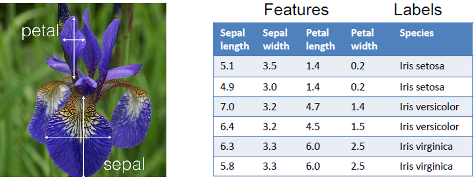
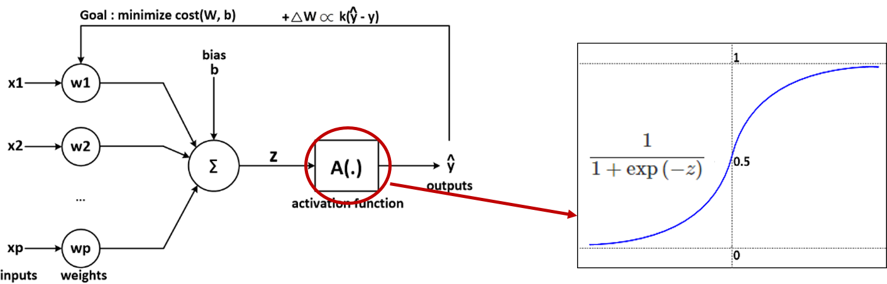
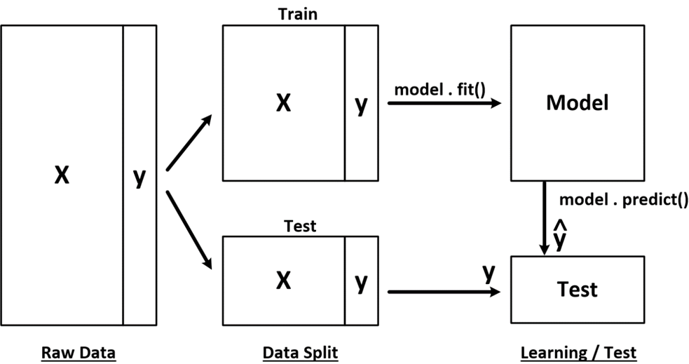
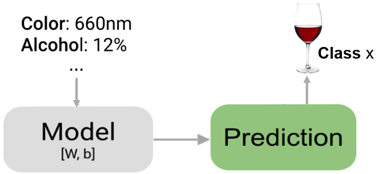

## 데이터 분석과 머신러닝 실습 3 : 분류(Classification)

<div style="text-align: right"> 작성자 : 데이터사이언스연구소 유광명, 이영생, 임혜원 </div>  
---


### 실습 3.1 IRIS(붓꽃) 품종 분류 문제

---
붓꽃의 품종을 분류하는 머신러닝 모델 만들기




**1) 첫번째 머신러닝 모델**  
로지스틱 회귀(Logistic regression) 분류 모델


**라이브러리 import**


```python
import numpy as np #numpy
import pandas as pd #pandas
```


**데이터 읽어오기 및 기본정보 확인**  
pandas의 read_csv 메서드를 사용하여 데이터 셋을 iris 변수에 저장한다.


```python
iris = pd.read_csv('data/iris.data', header = None)
```


```python
type(iris)
```


    pandas.core.frame.DataFrame


데이터는 DataFrame 형식이다.

head() 메서드로 데이터의 최초 5개 샘플을 확인한다.


```python
iris.head()
```

<table border="1" class="dataframe">
  <thead>
    <tr style="text-align: right;">
      <th></th>
      <th>0</th>
      <th>1</th>
      <th>2</th>
      <th>3</th>
      <th>4</th>
    </tr>
  </thead>
  <tbody>
    <tr>
      <th>0</th>
      <td>5.1</td>
      <td>3.5</td>
      <td>1.4</td>
      <td>0.2</td>
      <td>Iris-setosa</td>
    </tr>
    <tr>
      <th>1</th>
      <td>4.9</td>
      <td>3.0</td>
      <td>1.4</td>
      <td>0.2</td>
      <td>Iris-setosa</td>
    </tr>
    <tr>
      <th>2</th>
      <td>4.7</td>
      <td>3.2</td>
      <td>1.3</td>
      <td>0.2</td>
      <td>Iris-setosa</td>
    </tr>
    <tr>
      <th>3</th>
      <td>4.6</td>
      <td>3.1</td>
      <td>1.5</td>
      <td>0.2</td>
      <td>Iris-setosa</td>
    </tr>
    <tr>
      <th>4</th>
      <td>5.0</td>
      <td>3.6</td>
      <td>1.4</td>
      <td>0.2</td>
      <td>Iris-setosa</td>
    </tr>
  </tbody>
</table>


```python
iris.head(10)
```

<table border="1" class="dataframe">
  <thead>
    <tr style="text-align: right;">
      <th></th>
      <th>0</th>
      <th>1</th>
      <th>2</th>
      <th>3</th>
      <th>4</th>
    </tr>
  </thead>
  <tbody>
    <tr>
      <th>0</th>
      <td>5.1</td>
      <td>3.5</td>
      <td>1.4</td>
      <td>0.2</td>
      <td>Iris-setosa</td>
    </tr>
    <tr>
      <th>1</th>
      <td>4.9</td>
      <td>3.0</td>
      <td>1.4</td>
      <td>0.2</td>
      <td>Iris-setosa</td>
    </tr>
    <tr>
      <th>2</th>
      <td>4.7</td>
      <td>3.2</td>
      <td>1.3</td>
      <td>0.2</td>
      <td>Iris-setosa</td>
    </tr>
    <tr>
      <th>3</th>
      <td>4.6</td>
      <td>3.1</td>
      <td>1.5</td>
      <td>0.2</td>
      <td>Iris-setosa</td>
    </tr>
    <tr>
      <th>4</th>
      <td>5.0</td>
      <td>3.6</td>
      <td>1.4</td>
      <td>0.2</td>
      <td>Iris-setosa</td>
    </tr>
    <tr>
      <th>5</th>
      <td>5.4</td>
      <td>3.9</td>
      <td>1.7</td>
      <td>0.4</td>
      <td>Iris-setosa</td>
    </tr>
    <tr>
      <th>6</th>
      <td>4.6</td>
      <td>3.4</td>
      <td>1.4</td>
      <td>0.3</td>
      <td>Iris-setosa</td>
    </tr>
    <tr>
      <th>7</th>
      <td>5.0</td>
      <td>3.4</td>
      <td>1.5</td>
      <td>0.2</td>
      <td>Iris-setosa</td>
    </tr>
    <tr>
      <th>8</th>
      <td>4.4</td>
      <td>2.9</td>
      <td>1.4</td>
      <td>0.2</td>
      <td>Iris-setosa</td>
    </tr>
    <tr>
      <th>9</th>
      <td>4.9</td>
      <td>3.1</td>
      <td>1.5</td>
      <td>0.1</td>
      <td>Iris-setosa</td>
    </tr>
  </tbody>
</table>


타겟 변수만 살펴보기(5번째 컬럼)


```python
iris[4].head()
```


    0    Iris-setosa
    1    Iris-setosa
    2    Iris-setosa
    3    Iris-setosa
    4    Iris-setosa
    Name: 4, dtype: object


```python
type(iris[4])
```


    pandas.core.series.Series


단일 컬럼만 인덱싱 하면 series 타입으로 리턴된다.

unique 메서드로 타겟(또는 클래스)의 종류 확인한다.


```python
iris[4].unique()
```


    array(['Iris-setosa', 'Iris-versicolor', 'Iris-virginica'], dtype=object)


타겟의 종류는 3가지 이다.


```python
iris.shape
```


    (150, 5)


150x5, 2차원 데이터 셋이다.


**데이터 전처리**  
데이터 셋을 입력(피처)과 출력(타겟)으로 나눈다.


```python
X = iris.iloc[:, 0:3]
y = iris.iloc[:, 4]
```


데이터 셋이 잘 분리되었는지 확인한다.


```python
X.head()
```

<table border="1" class="dataframe">
  <thead>
    <tr style="text-align: right;">
      <th></th>
      <th>0</th>
      <th>1</th>
      <th>2</th>
    </tr>
  </thead>
  <tbody>
    <tr>
      <th>0</th>
      <td>5.1</td>
      <td>3.5</td>
      <td>1.4</td>
    </tr>
    <tr>
      <th>1</th>
      <td>4.9</td>
      <td>3.0</td>
      <td>1.4</td>
    </tr>
    <tr>
      <th>2</th>
      <td>4.7</td>
      <td>3.2</td>
      <td>1.3</td>
    </tr>
    <tr>
      <th>3</th>
      <td>4.6</td>
      <td>3.1</td>
      <td>1.5</td>
    </tr>
    <tr>
      <th>4</th>
      <td>5.0</td>
      <td>3.6</td>
      <td>1.4</td>
    </tr>
  </tbody>
</table>


```python
y.head()
```


    0    Iris-setosa
    1    Iris-setosa
    2    Iris-setosa
    3    Iris-setosa
    4    Iris-setosa
    Name: 4, dtype: object


**모델학습(Training)**  
로지스틱 회귀(Logistic Regression) 모델을 생성하고, 데이터 셋으로 학습시킨다.




```python
from sklearn.linear_model import LogisticRegression
```


```python
logreg = LogisticRegression() # 모델생성
```


```python
logreg.fit(X, y) # 모델학습
```

    LogisticRegression(C=1.0, class_weight=None, dual=False, fit_intercept=True,
              intercept_scaling=1, max_iter=100, multi_class='warn',
              n_jobs=None, penalty='l2', random_state=None, solver='warn',
              tol=0.0001, verbose=0, warm_start=False)


**성능평가(Evaluation)**

피처 데이터만 입력하여 예측결과를 저장한다.


```python
y_pred = logreg.predict(X)
```


```python
y_pred[:5]
```


    array(['Iris-setosa', 'Iris-setosa', 'Iris-setosa', 'Iris-setosa',
           'Iris-setosa'], dtype=object)


실제 결과와 예측 결과를 비교하여 평균을 계산한다.


```python
np.mean(y_pred==y)
```


    0.9333333333333333


모델의 score 메서드를 사용해서 동일한 결과를 얻을수도 있다.


```python
logreg.score(X, y)
```


    0.9333333333333333


**2) 데이터셋을 분리하여 학습/ 검증하기**  
로지스틱 회귀(Logistic regression)




**데이터 읽기**


```python
iris = pd.read_csv('data/iris.data', header = None)
```


**데이터 전처리 및 학습/ 시험 데이터 나누기**  

- 데이터 셋을 입력(피처)과 출력(타겟)으로 나눈다.
- 학습 데이터와 시험(검증) 데이터로 분리한다.


```python
X = iris.iloc[:, 0:3]
y = iris.iloc[:, 4]
```


사이킷런의 train_test_split 라이브러리를 사용하여 학습, 시험 데이터로 분리한다.


```python
from sklearn.model_selection import train_test_split
```


```python
X_train, X_test, y_train, y_test = train_test_split(X, y, 
                                    stratify = y, random_state = 7,test_size = 0.3)
```


```python
print('X_train :',X_train.shape)
print('y_train :',y_train.shape)
print('X_test :',X_test.shape)
print('y_test :',y_test.shape)
```

    X_train : (105, 3)
    y_train : (105,)
    X_test : (45, 3)
    y_test : (45,)


**모델학습(Training)**  
학습용 데이터(X_train, y_train)로 모델을 학습시킨다.


```python
from sklearn.linear_model import LogisticRegression
```


```python
logreg = LogisticRegression(random_state=7)
```


```python
logreg.fit(X_train, y_train)
```

    LogisticRegression(C=1.0, class_weight=None, dual=False, fit_intercept=True,
              intercept_scaling=1, max_iter=100, multi_class='warn',
              n_jobs=None, penalty='l2', random_state=7, solver='warn',
              tol=0.0001, verbose=0, warm_start=False)


**성능평가(Evaluation)**  
시험용 데이터(X_test, y_test)로 모델 성능을 평가한다.


```python
logreg.score(X_train, y_train)
```


    0.9333333333333333


```python
logreg.score(X_test, y_test)
```


    0.9111111111111111

- 학습용 데이터 성능평가 결과 :93.33%  
- 시험용 데이터 성능평가 결과 :91.11%
- 

predict_proba 메서드를 사용하면 각 클래스의 예측확률을 확인할 수 있다.


```python
proba = logreg.predict_proba(X_test)
proba
```


    array([[2.97544814e-01, 6.49106544e-01, 5.33486425e-02],
           [8.37628637e-02, 7.56095593e-01, 1.60141543e-01],
           [3.73246557e-04, 3.91214781e-01, 6.08411972e-01],
           [8.95529739e-01, 1.04372594e-01, 9.76676062e-05],...


### 실습 3.2 와인 등급 분류 문제
---
와인의 등급을 분류하는 머신러닝 모델 만들기




**라이브러리 import**


```python
import numpy as np #numpy
import pandas as pd #pandas

from sklearn.model_selection import train_test_split
from sklearn.linear_model import LogisticRegression
```


**데이터 읽어오기 및 기본정보 확인**  
pandas의 read_csv 메서드를 사용하여 데이터 셋을 wine 변수에 저장


```python
wine = pd.read_csv('data/wine.data')
```


```python
wine.head()
```

<table border="1" class="dataframe">
  <thead>
    <tr style="text-align: right;">
      <th></th>
      <th>Class label</th>
      <th>Alcohol</th>
      <th>Malic acid</th>
      <th>Ash</th>
      <th>Alcalinity of ash</th>
      <th>Magnesium</th>
      <th>Total phenols</th>
      <th>Flavanoids</th>
      <th>Nonflavnoid phenols</th>
      <th>Proanthocyanins</th>
      <th>Color intensity</th>
      <th>Hue</th>
      <th>OD280/OD315 of diluted wines</th>
      <th>Proline</th>
    </tr>
  </thead>
  <tbody>
    <tr>
      <th>0</th>
      <td>1</td>
      <td>14.23</td>
      <td>1.71</td>
      <td>2.43</td>
      <td>15.6</td>
      <td>127</td>
      <td>2.80</td>
      <td>3.06</td>
      <td>0.28</td>
      <td>2.29</td>
      <td>5.64</td>
      <td>1.04</td>
      <td>3.92</td>
      <td>1065</td>
    </tr>
    <tr>
      <th>1</th>
      <td>1</td>
      <td>13.20</td>
      <td>1.78</td>
      <td>2.14</td>
      <td>11.2</td>
      <td>100</td>
      <td>2.65</td>
      <td>2.76</td>
      <td>0.26</td>
      <td>1.28</td>
      <td>4.38</td>
      <td>1.05</td>
      <td>3.40</td>
      <td>1050</td>
    </tr>
    <tr>
      <th>2</th>
      <td>1</td>
      <td>13.16</td>
      <td>2.36</td>
      <td>2.67</td>
      <td>18.6</td>
      <td>101</td>
      <td>2.80</td>
      <td>3.24</td>
      <td>0.30</td>
      <td>2.81</td>
      <td>5.68</td>
      <td>1.03</td>
      <td>3.17</td>
      <td>1185</td>
    </tr>
    <tr>
      <th>3</th>
      <td>1</td>
      <td>14.37</td>
      <td>1.95</td>
      <td>2.50</td>
      <td>16.8</td>
      <td>113</td>
      <td>3.85</td>
      <td>3.49</td>
      <td>0.24</td>
      <td>2.18</td>
      <td>7.80</td>
      <td>0.86</td>
      <td>3.45</td>
      <td>1480</td>
    </tr>
    <tr>
      <th>4</th>
      <td>1</td>
      <td>13.24</td>
      <td>2.59</td>
      <td>2.87</td>
      <td>21.0</td>
      <td>118</td>
      <td>2.80</td>
      <td>2.69</td>
      <td>0.39</td>
      <td>1.82</td>
      <td>4.32</td>
      <td>1.04</td>
      <td>2.93</td>
      <td>735</td>
    </tr>
  </tbody>
</table>


타겟 컬럼은 'Class label'이다.


```python
wine['Class label'].unique()
```


    array([1, 2, 3], dtype=int64)


타겟의 종류는 3가지 이다. 


```python
wine.shape
```


    (178, 14)


178x14, 2차원 데이터 셋이다

**데이터 전처리 및 학습/ 시험 데이터 나누기**  
- 데이터 셋을 입력(피처)과 출력(타겟)으로 나눈다.
- 학습 데이터와 시험(검증) 데이터로 분리한다.


```python
X = wine.iloc[:, 1:14]
y = wine.iloc[:, 0]
```


```python
X.head()
```

<table border="1" class="dataframe">
  <thead>
    <tr style="text-align: right;">
      <th></th>
      <th>Alcohol</th>
      <th>Malic acid</th>
      <th>Ash</th>
      <th>Alcalinity of ash</th>
      <th>Magnesium</th>
      <th>Total phenols</th>
      <th>Flavanoids</th>
      <th>Nonflavnoid phenols</th>
      <th>Proanthocyanins</th>
      <th>Color intensity</th>
      <th>Hue</th>
      <th>OD280/OD315 of diluted wines</th>
      <th>Proline</th>
    </tr>
  </thead>
  <tbody>
    <tr>
      <th>0</th>
      <td>14.23</td>
      <td>1.71</td>
      <td>2.43</td>
      <td>15.6</td>
      <td>127</td>
      <td>2.80</td>
      <td>3.06</td>
      <td>0.28</td>
      <td>2.29</td>
      <td>5.64</td>
      <td>1.04</td>
      <td>3.92</td>
      <td>1065</td>
    </tr>
    <tr>
      <th>1</th>
      <td>13.20</td>
      <td>1.78</td>
      <td>2.14</td>
      <td>11.2</td>
      <td>100</td>
      <td>2.65</td>
      <td>2.76</td>
      <td>0.26</td>
      <td>1.28</td>
      <td>4.38</td>
      <td>1.05</td>
      <td>3.40</td>
      <td>1050</td>
    </tr>
    <tr>
      <th>2</th>
      <td>13.16</td>
      <td>2.36</td>
      <td>2.67</td>
      <td>18.6</td>
      <td>101</td>
      <td>2.80</td>
      <td>3.24</td>
      <td>0.30</td>
      <td>2.81</td>
      <td>5.68</td>
      <td>1.03</td>
      <td>3.17</td>
      <td>1185</td>
    </tr>
    <tr>
      <th>3</th>
      <td>14.37</td>
      <td>1.95</td>
      <td>2.50</td>
      <td>16.8</td>
      <td>113</td>
      <td>3.85</td>
      <td>3.49</td>
      <td>0.24</td>
      <td>2.18</td>
      <td>7.80</td>
      <td>0.86</td>
      <td>3.45</td>
      <td>1480</td>
    </tr>
    <tr>
      <th>4</th>
      <td>13.24</td>
      <td>2.59</td>
      <td>2.87</td>
      <td>21.0</td>
      <td>118</td>
      <td>2.80</td>
      <td>2.69</td>
      <td>0.39</td>
      <td>1.82</td>
      <td>4.32</td>
      <td>1.04</td>
      <td>2.93</td>
      <td>735</td>
    </tr>
  </tbody>
</table>


```python
y.head()
```


    0    1
    1    1
    2    1
    3    1
    4    1
    Name: Class label, dtype: int64


```python
X_train, X_test, y_train, y_test = train_test_split(X, y, 
                                    stratify = y, random_state = 7,test_size = 0.3)
```


**모델학습(Training)**  
학습용 데이터(X_train, y_train)로 모델을 학습시킨다.


```python
logreg = LogisticRegression(random_state=7)
```


```python
logreg.fit(X_train, y_train)
```

    LogisticRegression(C=1.0, class_weight=None, dual=False, fit_intercept=True,
              intercept_scaling=1, max_iter=100, multi_class='warn',
              n_jobs=None, penalty='l2', random_state=7, solver='warn',
              tol=0.0001, verbose=0, warm_start=False)


**성능평가(Evaluation)**  
시험용 데이터(X_test, y_test)로 모델 성능을 평가한다.


```python
logreg.score(X_train, y_train)
```


    0.9919354838709677


```python
logreg.score(X_test, y_test)
```


    0.9444444444444444
