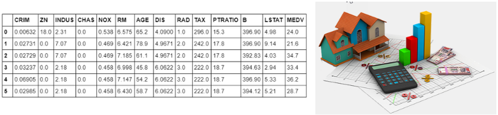
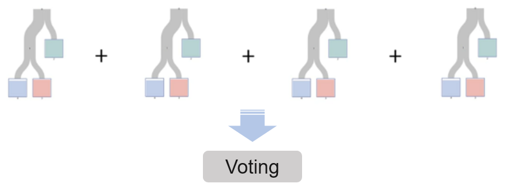
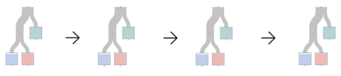

## 데이터 분석과 머신러닝 실습 4 : 회귀(Regression)

<div style="text-align: right"> 작성자 : 데이터사이언스연구소 유광명, 이영생, 임혜원
</div>  

---


### 실습 4.1 Boston housing 문제

---
보스턴 지역의 주택정보 데이터를 바탕으로 주택 가격을 예측하는 모델 만들기 




**1) 머신러닝 모델**  
선형회귀(Linear regression)


**라이브러리 import**


```python
import numpy as np #numpy
import pandas as pd #pandas

from sklearn.model_selection import train_test_split
```


**데이터 읽어오기 및 기본정보 확인**  
사이킷런 라이브러리 내부에서 데이터 셋 읽어오기


```python
from sklearn.datasets import load_boston
```


```python
boston = load_boston()
```


```python
type(boston)
```


    sklearn.utils.Bunch


데이터는 'Bunch' 형태로 구성되어 있다.


```python
boston
```


    {'data': array([[6.3200e-03, 1.8000e+01, 2.3100e+00, ..., 1.5300e+01, 3.9690e+02,
             4.9800e+00],
            [2.7310e-02, 0.0000e+00, 7.0700e+00, ..., 1.7800e+01, 3.9690e+02,
             9.1400e+00],...


DESCR 메서드는 데이터셋의 설명정보가 담겨있다.


```python
boston.DESCR
```


    ".. _boston_dataset:\n\nBoston house prices dataset\n---------------------------\n\n**Data Set Characteristics:**  \n\n    :Number of Instances: 506 \n\n    :Number of Attributes: 13 numeric/categorical predictive. Median Value (attribute 14) is usually the target.\n\n    :Attribute Information (in order):\n        ...


data 메서드로 피처 데이터에 접근 가능하다.


```python
boston.data
```


    array([[6.3200e-03, 1.8000e+01, 2.3100e+00, ..., 1.5300e+01, 3.9690e+02,
            4.9800e+00],
           [2.7310e-02, 0.0000e+00, 7.0700e+00, ..., 1.7800e+01, 3.9690e+02,
            9.1400e+00],
           [2.7290e-02, 0.0000e+00, 7.0700e+00, ..., 1.7800e+01, 3.9283e+02,
            4.0300e+00],  ...,


target 메서드로 타겟 데이터에 접근 가능하다.


```python
boston.target
```


    array([24. , 21.6, 34.7, 33.4, 36.2, 28.7, 22.9, 27.1, 16.5, 18.9, 15. ,
           18.9, 21.7, 20.4, 18.2, 19.9, 23.1, 17.5, 20.2, 18.2, 13.6, 19.6,
           15.2, 14.5, 15.6, 13.9, 16.6, 14.8, 18.4, 21. , 12.7, 14.5, 13.2,
           13.1, 13.5, 18.9, 20. , 21. , 24.7, 30.8, 34.9, 26.6, 25.3, 24.7,
           21.2, 19.3, 20. , 16.6, 14.4, 19.4, ...


피처명은 feature_names 컬럼에 저장되어 있다.


```python
boston.feature_names
```


    array(['CRIM', 'ZN', 'INDUS', 'CHAS', 'NOX', 'RM', 'AGE', 'DIS', 'RAD',
           'TAX', 'PTRATIO', 'B', 'LSTAT'], dtype='<U7')


피처 데이터를 데이터프레임으로 저장한다.


```python
data = pd.DataFrame(boston.data, columns=boston.feature_names)
```


```python
data.head()
```

<table border="1" class="dataframe">
  <thead>
    <tr style="text-align: right;">
      <th></th>
      <th>CRIM</th>
      <th>ZN</th>
      <th>INDUS</th>
      <th>CHAS</th>
      <th>NOX</th>
      <th>RM</th>
      <th>AGE</th>
      <th>DIS</th>
      <th>RAD</th>
      <th>TAX</th>
      <th>PTRATIO</th>
      <th>B</th>
      <th>LSTAT</th>
    </tr>
  </thead>
  <tbody>
    <tr>
      <th>0</th>
      <td>0.00632</td>
      <td>18.0</td>
      <td>2.31</td>
      <td>0.0</td>
      <td>0.538</td>
      <td>6.575</td>
      <td>65.2</td>
      <td>4.0900</td>
      <td>1.0</td>
      <td>296.0</td>
      <td>15.3</td>
      <td>396.90</td>
      <td>4.98</td>
    </tr>
    <tr>
      <th>1</th>
      <td>0.02731</td>
      <td>0.0</td>
      <td>7.07</td>
      <td>0.0</td>
      <td>0.469</td>
      <td>6.421</td>
      <td>78.9</td>
      <td>4.9671</td>
      <td>2.0</td>
      <td>242.0</td>
      <td>17.8</td>
      <td>396.90</td>
      <td>9.14</td>
    </tr>
    <tr>
      <th>2</th>
      <td>0.02729</td>
      <td>0.0</td>
      <td>7.07</td>
      <td>0.0</td>
      <td>0.469</td>
      <td>7.185</td>
      <td>61.1</td>
      <td>4.9671</td>
      <td>2.0</td>
      <td>242.0</td>
      <td>17.8</td>
      <td>392.83</td>
      <td>4.03</td>
    </tr>
    <tr>
      <th>3</th>
      <td>0.03237</td>
      <td>0.0</td>
      <td>2.18</td>
      <td>0.0</td>
      <td>0.458</td>
      <td>6.998</td>
      <td>45.8</td>
      <td>6.0622</td>
      <td>3.0</td>
      <td>222.0</td>
      <td>18.7</td>
      <td>394.63</td>
      <td>2.94</td>
    </tr>
    <tr>
      <th>4</th>
      <td>0.06905</td>
      <td>0.0</td>
      <td>2.18</td>
      <td>0.0</td>
      <td>0.458</td>
      <td>7.147</td>
      <td>54.2</td>
      <td>6.0622</td>
      <td>3.0</td>
      <td>222.0</td>
      <td>18.7</td>
      <td>396.90</td>
      <td>5.33</td>
    </tr>
  </tbody>
</table>


데이터에 타겟 값을 'PRICE' 컬럼에 추가한다.


```python
data['PRICE'] = boston.target
```


```python
data.head()
```

<table border="1" class="dataframe">
  <thead>
    <tr style="text-align: right;">
      <th></th>
      <th>CRIM</th>
      <th>ZN</th>
      <th>INDUS</th>
      <th>CHAS</th>
      <th>NOX</th>
      <th>RM</th>
      <th>AGE</th>
      <th>DIS</th>
      <th>RAD</th>
      <th>TAX</th>
      <th>PTRATIO</th>
      <th>B</th>
      <th>LSTAT</th>
      <th>PRICE</th>
    </tr>
  </thead>
  <tbody>
    <tr>
      <th>0</th>
      <td>0.00632</td>
      <td>18.0</td>
      <td>2.31</td>
      <td>0.0</td>
      <td>0.538</td>
      <td>6.575</td>
      <td>65.2</td>
      <td>4.0900</td>
      <td>1.0</td>
      <td>296.0</td>
      <td>15.3</td>
      <td>396.90</td>
      <td>4.98</td>
      <td>24.0</td>
    </tr>
    <tr>
      <th>1</th>
      <td>0.02731</td>
      <td>0.0</td>
      <td>7.07</td>
      <td>0.0</td>
      <td>0.469</td>
      <td>6.421</td>
      <td>78.9</td>
      <td>4.9671</td>
      <td>2.0</td>
      <td>242.0</td>
      <td>17.8</td>
      <td>396.90</td>
      <td>9.14</td>
      <td>21.6</td>
    </tr>
    <tr>
      <th>2</th>
      <td>0.02729</td>
      <td>0.0</td>
      <td>7.07</td>
      <td>0.0</td>
      <td>0.469</td>
      <td>7.185</td>
      <td>61.1</td>
      <td>4.9671</td>
      <td>2.0</td>
      <td>242.0</td>
      <td>17.8</td>
      <td>392.83</td>
      <td>4.03</td>
      <td>34.7</td>
    </tr>
    <tr>
      <th>3</th>
      <td>0.03237</td>
      <td>0.0</td>
      <td>2.18</td>
      <td>0.0</td>
      <td>0.458</td>
      <td>6.998</td>
      <td>45.8</td>
      <td>6.0622</td>
      <td>3.0</td>
      <td>222.0</td>
      <td>18.7</td>
      <td>394.63</td>
      <td>2.94</td>
      <td>33.4</td>
    </tr>
    <tr>
      <th>4</th>
      <td>0.06905</td>
      <td>0.0</td>
      <td>2.18</td>
      <td>0.0</td>
      <td>0.458</td>
      <td>7.147</td>
      <td>54.2</td>
      <td>6.0622</td>
      <td>3.0</td>
      <td>222.0</td>
      <td>18.7</td>
      <td>396.90</td>
      <td>5.33</td>
      <td>36.2</td>
    </tr>
  </tbody>
</table>


```python
data.shape
```


    (506, 14)


**데이터 전처리 및 학습/ 시험 데이터 나누기**  
- 데이터 셋을 입력(피처)과 출력(타겟)으로 나눈다.
- 학습 데이터와 시험(검증) 데이터로 분리한다.


```python
X = data.iloc[:, 0:13]
y = data.iloc[:, 13]
```


```python
X.head()
```

<table border="1" class="dataframe">
  <thead>
    <tr style="text-align: right;">
      <th></th>
      <th>CRIM</th>
      <th>ZN</th>
      <th>INDUS</th>
      <th>CHAS</th>
      <th>NOX</th>
      <th>RM</th>
      <th>AGE</th>
      <th>DIS</th>
      <th>RAD</th>
      <th>TAX</th>
      <th>PTRATIO</th>
      <th>B</th>
      <th>LSTAT</th>
    </tr>
  </thead>
  <tbody>
    <tr>
      <th>0</th>
      <td>0.00632</td>
      <td>18.0</td>
      <td>2.31</td>
      <td>0.0</td>
      <td>0.538</td>
      <td>6.575</td>
      <td>65.2</td>
      <td>4.0900</td>
      <td>1.0</td>
      <td>296.0</td>
      <td>15.3</td>
      <td>396.90</td>
      <td>4.98</td>
    </tr>
    <tr>
      <th>1</th>
      <td>0.02731</td>
      <td>0.0</td>
      <td>7.07</td>
      <td>0.0</td>
      <td>0.469</td>
      <td>6.421</td>
      <td>78.9</td>
      <td>4.9671</td>
      <td>2.0</td>
      <td>242.0</td>
      <td>17.8</td>
      <td>396.90</td>
      <td>9.14</td>
    </tr>
    <tr>
      <th>2</th>
      <td>0.02729</td>
      <td>0.0</td>
      <td>7.07</td>
      <td>0.0</td>
      <td>0.469</td>
      <td>7.185</td>
      <td>61.1</td>
      <td>4.9671</td>
      <td>2.0</td>
      <td>242.0</td>
      <td>17.8</td>
      <td>392.83</td>
      <td>4.03</td>
    </tr>
    <tr>
      <th>3</th>
      <td>0.03237</td>
      <td>0.0</td>
      <td>2.18</td>
      <td>0.0</td>
      <td>0.458</td>
      <td>6.998</td>
      <td>45.8</td>
      <td>6.0622</td>
      <td>3.0</td>
      <td>222.0</td>
      <td>18.7</td>
      <td>394.63</td>
      <td>2.94</td>
    </tr>
    <tr>
      <th>4</th>
      <td>0.06905</td>
      <td>0.0</td>
      <td>2.18</td>
      <td>0.0</td>
      <td>0.458</td>
      <td>7.147</td>
      <td>54.2</td>
      <td>6.0622</td>
      <td>3.0</td>
      <td>222.0</td>
      <td>18.7</td>
      <td>396.90</td>
      <td>5.33</td>
    </tr>
  </tbody>
</table>


```python
y.head()
```


    0    24.0
    1    21.6
    2    34.7
    3    33.4
    4    36.2
    Name: PRICE, dtype: float64


```python
X_train, X_test, y_train, y_test = train_test_split(X, y, 
                                    random_state = 7,test_size = 0.3)
```


**모델학습(Training)**  
학습용 데이터(X_train, y_train)로 모델을 학습시킨다.


```python
from sklearn.linear_model import LinearRegression
```


```python
linreg = LinearRegression()
```


```python
linreg.fit(X_train, y_train)
```


    LinearRegression(copy_X=True, fit_intercept=True, n_jobs=None,
             normalize=False)


**성능평가(Evaluation)**  
시험용 데이터(X_test, y_test)로 모델 성능을 평가한다.


```python
linreg.score(X_train, y_train)
```


    0.7613288901253087


```python
linreg.score(X_test, y_test)
```


    0.6508417720329555


### 실습 4.2 Boston housing 문제 2
---
앙상블 모델을 사용하여 과소적합을 개선한다. 


**1) 랜덤 포레스트 모델**




**데이터 전처리 및 학습/ 시험 데이터 나누기**  

- 데이터 셋을 입력(피처)과 출력(타겟)으로 나눈다.

- 학습 데이터와 시험(검증) 데이터로 분리한다.

  


```python
X = data.iloc[:, 0:13]
y = data.iloc[:, 13]
X_train, X_test, y_train, y_test = train_test_split(X, y, 
                                    random_state = 7,test_size = 0.3)
```


**모델학습(Training)**  
학습용 데이터(X_train, y_train)로 모델을 학습시킨다.


```python
from sklearn.ensemble import RandomForestRegressor
```


```python
rfr = RandomForestRegressor(random_state=7)
```


```python
rfr.fit(X_train, y_train)
```

    RandomForestRegressor(bootstrap=True, criterion='mse', max_depth=None,
               max_features='auto', max_leaf_nodes=None,
               min_impurity_decrease=0.0, min_impurity_split=None,
               min_samples_leaf=1, min_samples_split=2,
               min_weight_fraction_leaf=0.0, n_estimators=10, n_jobs=None,
               oob_score=False, random_state=7, verbose=0, warm_start=False)


**성능평가(Evaluation)**  
시험용 데이터(X_test, y_test)로 모델 성능을 평가한다.


```python
rfr.score(X_train, y_train)
```


    0.9630431089671442


```python
rfr.score(X_test, y_test)
```


    0.794647277728811


**2) 그래디언트 부스팅 모델**




```python
from sklearn.ensemble import GradientBoostingRegressor
```


```python
gbr = GradientBoostingRegressor(random_state=7)
```


```python
gbr.fit(X_train, y_train)
```


    GradientBoostingRegressor(alpha=0.9, criterion='friedman_mse', init=None,
                 learning_rate=0.1, loss='ls', max_depth=3, max_features=None,
                 max_leaf_nodes=None, min_impurity_decrease=0.0,
                 min_impurity_split=None, min_samples_leaf=1,
                 min_samples_split=2, min_weight_fraction_leaf=0.0,
                 n_estimators=100, n_iter_no_change=None, presort='auto',
                 random_state=7, subsample=1.0, tol=0.0001,
                 validation_fraction=0.1, verbose=0, warm_start=False)


```python
gbr.score(X_train, y_train)
```


    0.9823391224838423


```python
gbr.score(X_test, y_test)
```


    0.8673937530774127


**특성 중요도(Feature importance**)


```python
feature_importance = pd.Series(gbr.feature_importances_)
feature_importance.index = boston.feature_names
```


```python
feature_importance.sort_values().plot(kind = 'barh', figsize = (12, 6))
```


**3) 하이퍼 파라미터 튜닝**  
그래디언트 부스팅 모델의 최적의 max_depth 찾기


```python
scores = []
for depth in range(1, 13):
    gbr = GradientBoostingRegressor(max_depth = depth, random_state=7)
    gbr.fit(X_train, y_train)
    train_score = gbr.score(X_train, y_train)
    test_score = gbr.score(X_test, y_test)
    scores.append((train_score, test_score))
```


```python
result = pd.DataFrame(scores, columns=['train', 'test'])
result.index = range(1, 13)
result.plot(style = ['go--', 'ro--'], figsize = (12, 6))
```


